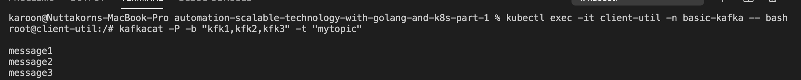

# Basic Kafka (Message queue)

- Producer : Producue message to queue
- Consumer : Get message form queue
- Broker : server แต่ละตัว
- Topic : คือหัวข้อที่ Producer ส่งเข้าไป และ Consumer จะเป็นคนดึง topic ออกมาทำงานต่อ 
> ถ้า topic นี้ consumer ไหนสนใจก็จะมาทำการ subscripe ที่ topic นั้น
- Partition : คือการแบ่ง topic เดียวกัน ออกเป็นส่วนๆ 
> ทำไมเราต้องแบ่ง topic เป็น partition ? => เพราะว่าจำนวน partition นั้นจะเป็นตัวกำหนด consumer นั้นเอง ถ้าเราต้องการให้มี Consumer หลายๆ ตัวมาช่วยกันทำงาน กับ topic นั้น เราจะต้องทำการแบ่ง partition ของ topic นั้น

> โดย Default พอเรากำหนด kube ขึ้นมามันจะมีค่า parditions ประมาณ 50 ``0-49`` โดยเมื่อมีการ push message มาจาก Producer ก็จะทำการ random message นั้นไปอยู่ใน partition ที่มีการสร้างเอาไว้ แล้ว consumer ก็จะทำการอ่านค่ามาจาก parditions เอง และถ้ามีการ partition ไหนมี message เข้ามาแล้วค่า offset ก็จะมีค่าเพิ่มยึ้นเช่น เริมต้่น offset 0 แต่พอมี message ค่า offset จะเป็น 1 และถ้ามีการเข้ามาที่ partition เดิมอีกที offset จะเป็น 2 

## Detail

### Producer
producer จะทำการส่งข้อมูล massage (topic) โดยการ random ไปยังทุกๆ partition ยกเว้นถ้าเรามีการกำหนด messageId มันจะทำการไปที่ partition เดิมเสมอ 

โดยใน partition นั้นจะมีการเรียงลำดับของ message กันในแต่ละ partition และเมื่อมี Consumer มาเรียกใช้งานข้อมูลในแต่ละ partition ก็จะทำการอ่านข้อมูลตามลำดับ ซึ่งจะมี index ที่จะเป็นชี้ว่ามีการอ่านข้อมูลที่ลำดับที่เท่าไร หรือก็คือ ``offset`` 

### Consumer
- consumer group คือ consumer ที่อยู่ในกลุ่มเดียวกันที่จะอ่านข้อมูลของ topic เดียวกันแต่จะได้ Message ไม่ซ้ำกัน 
> แต่ละ consumer จะอ่านกันคนละ partition

ex : ถ้าเรามี 3 partition และมี Consumer group ซึ่งจะประกอบไปด้วย 3 consumer โดยแต่ละ consumer จะทำการอ่านข้อมูล กันคนละ partition 


> แต่ถ้ามี consumer ใน group ตายไป 1 ตัว (เหลือแค่ 2 consumer) ระบบจะไม่ยอมให้มี partition ที่ไม่ถูกการอ่าน message ออกไป ดังนั้น consumer ที่เหลือ 2 ตัวจะมีอยู่ 1 ตัวที่ต้องไปทำการอ่านจากข้อมูลพร้อมกันทั้ง 2 partition ทำการอ่านข้อมูล ``การ re-balanch ``


> แล้วถ้ามี 3 partition แต่ใน consumer group นั้นมี 4 consumer สิ่งที่เกิดขึ้นคือ จะมี consumer ตัวหนึ่งที่จะไม่มีการอ่านค่าจาก partition (เพราะเรามีแค่ 3 partitions) มันจะเป็นไปตาม concept ที่ว่า ``จำนวนของ partition นั้นจะเป็นสิ่งที่บอกจำนวน consumer``

## Workshop
### run kafka


1. Create namespace

```powershell
---- create namespace ----
% kubectl apply -f 00-namespace.yml 
namespace/basic-kafka created

---- check namespace ----
% kubectl get ns
NAME              STATUS   AGE
basic-kafka       Active   55s
default           Active   60d
ingress-nginx     Active   45h
kube-node-lease   Active   60d
kube-public       Active   60d
kube-system       Active   60d

```
2. Create zookeeper deployment
> zookeeper คือ software สำหรับเก็บข้อมูลที่ใช้สำหรับให้ kafka ใช้ในการอ่านระบุที่สำหรับการอ่านข้อมูลจาก partition

```powershell
--- create zk (zookeeper) 3 items ---
% kubectl apply -f 01-deployment-zk.yml
deployment.apps/zk1 created
deployment.apps/zk2 created
deployment.apps/zk3 created

--- check zookeeper ---
% kubectl get pods -n basic-kafka
NAME                   READY   STATUS    RESTARTS   AGE
zk1-76cc547698-8nhnj   1/1     Running   0          87s
zk2-7bb59d6788-tbz4d   1/1     Running   0          87s
zk3-566db54d6b-gqkzm   1/1     Running   0          87s

```

3. Create zookeeper service
```powershell
--- create service ---
kubectl apply -f 02-service-zk.yml
service/zk1 created
service/zk2 created
service/zk3 created

--- check service
% kubectl get service -n basic-kafka
NAME   TYPE        CLUSTER-IP   EXTERNAL-IP   PORT(S)                      AGE
zk1    ClusterIP   None         <none>        2181/TCP,2888/TCP,3888/TCP   38s
zk2    ClusterIP   None         <none>        2181/TCP,2888/TCP,3888/TCP   38s
zk3    ClusterIP   None         <none>        2181/TCP,2888/TCP,3888/TCP   38s
```

4. Create kafka deployment
```powershell
--- create kafka ---
kubectl apply -f 03-deployment-kfk.yml
deployment.apps/kfk1 created
deployment.apps/kfk2 created
deployment.apps/kfk3 created

--- Check ---
kubectl get po -n basic-kafka
NAME                    READY   STATUS    RESTARTS   AGE
kfk1-86886b6b84-2pj7d   1/1     Running   0          89s
kfk2-5b69dfcdb4-t9nz4   1/1     Running   0          88s
kfk3-6d4c8874c6-sksmh   1/1     Running   0          88s
zk1-76cc547698-8nhnj    1/1     Running   0          10m
zk2-7bb59d6788-tbz4d    1/1     Running   0          10m
zk3-566db54d6b-gqkzm    1/1     Running   0          10m

```

5. create kafka service

```powershell
kubectl apply -f 04-service-kfk.yml
service/kfk1 created
service/kfk2 created
service/kfk3 created

--- check service ---
kubectl get svc -n basic-kafka
NAME   TYPE        CLUSTER-IP   EXTERNAL-IP   PORT(S)                      AGE
kfk1   ClusterIP   None         <none>        9092/TCP                     26s
kfk2   ClusterIP   None         <none>        9092/TCP                     26s
kfk3   ClusterIP   None         <none>        9092/TCP                     26s
zk1    ClusterIP   None         <none>        2181/TCP,2888/TCP,3888/TCP   6m12s
zk2    ClusterIP   None         <none>        2181/TCP,2888/TCP,3888/TCP   6m12s
zk3    ClusterIP   None         <none>        2181/TCP,2888/TCP,3888/TCP   6m12s

```

6. Create client-util pod
> เราสามารถดู detail ของ pod ด้วย ``kubectl describe pod kfk1-86886b6b84-2pj7d -n basic-kafka``
```powershell
kubectl apply -f 05-client-util.yml
pod/client-util created

--- check ---
kubectl get po -n basic-kafka      
NAME                    READY   STATUS    RESTARTS   AGE
client-util             1/1     Running   0          28s
kfk1-86886b6b84-2pj7d   1/1     Running   0          7m13s
kfk2-5b69dfcdb4-t9nz4   1/1     Running   0          7m12s
kfk3-6d4c8874c6-sksmh   1/1     Running   0          7m12s
zk1-76cc547698-8nhnj    1/1     Running   0          16m
zk2-7bb59d6788-tbz4d    1/1     Running   0          16m
zk3-566db54d6b-gqkzm    1/1     Running   0          16m

--- Exec into client-util po ---
kubectl exec -it client-util -n basic-kafka -- bash
root@client-util:/# 
```

7. Run kafkacat -L to list brokers and topics

> kafkacat คือ

```powershell
--- access pod ---
kubectl exec -it client-util -n basic-kafka -- bash      
root@client-util:/# 

--- list brokers and topics
root@client-util:/# kafkacat -b "kfk1,kfk2,kfk3" -L
Metadata for all topics (from broker 3: kfk3:9092/3):
 3 brokers:
  broker 2 at kfk2:9092
  broker 3 at kfk3:9092
  broker 1 at kfk1:9092
 0 topics:

```

## workshop 02 play consumer producer (kafka)
Play with Kafkacat URL https://github.com/edenhill/kafkacat
> กรณีที่ object ที่เกี่ยวข้องไม่ว่าจะเป็น zoopkeeper หรือ kafka ใน minikube ไม่ทำงานเราสามารถ run command ``kubectl apply -f .``

1. Check สถานะของ pods และ service ทั้งหมด
```powershell
% kubectl get po -n basic-kafka
NAME                    READY   STATUS    RESTARTS   AGE
client-util             1/1     Running   2          21h
kfk1-86886b6b84-2pj7d   1/1     Running   5          21h
kfk2-5b69dfcdb4-t9nz4   1/1     Running   5          21h
kfk3-6d4c8874c6-sksmh   1/1     Running   4          21h
zk1-76cc547698-8nhnj    1/1     Running   2          21h
zk2-7bb59d6788-tbz4d    1/1     Running   2          21h
zk3-566db54d6b-gqkzm    1/1     Running   2          21h
```

2. Exec into client-util pod

```powershell
---- exec intp pod ----
kubectl exec -it client-util -n basic-kafka -- bash
root@client-util:/# 
```

3. ลองเล่น kafka ในมุมของ Producer
```powershell
root@client-util:/# kafkacat -P -b "kfk1,kfk2,kfk3" -t "mytopic"

# -P (Producer)
# -b (Broker target)
# -t "topic"
```
ทันทีที่เรา run command ใน terminal หน้าจอ terminal จะมีการเปิดค้างไว้ทันที เพื่อให้เรากรอก message ของ topic ``mytopic`` เข้าไปใน kafka ทันที 

และเราก็จะสามารถกรอกข้อมูลโดยการ input message1,message2,message3



4. ลองเล่นเป็น Consumer
```powershell
kubectl exec -it client-util -n basic-kafka -- bash
root@client-util:/# kafkacat -C -b "kfk1,kfk2,kfk3" -t "mytopic"
% Reached end of topic mytopic [1] at offset 0
.......
......
% Reached end of topic mytopic [40] at offset 0
message1
% Reached end of topic mytopic [46] at offset 0
% Reached end of topic mytopic [49] at offset 0
message3
% Reached end of topic mytopic [0] at offset 0
% Reached end of topic mytopic [43] at offset 1
% Reached end of topic mytopic [18] at offset 0
% Reached end of topic mytopic [21] at offset 0
message2
% Reached end of topic mytopic [27] at offset 0
% Reached end of topic mytopic [30] at offset 0
% Reached end of topic mytopic [33] at offset 0
% Reached end of topic mytopic [36] at offset 0
% Reached end of topic mytopic [39] at offset 0
% Reached end of topic mytopic [44] at offset 0
% Reached end of topic mytopic [47] at offset 0
% Reached end of topic mytopic [24] at offset 1
```

เมื่อเรา run command เสร็จ Consumer ก็จะได้ message จาก topic ทันที และถ้าเรามีการ input message4 ในส่วนของ producer และพอเรา switch หน้าจอมาที่ Consumer และเราก็จะเห็น message4 ทันที

```powershell
--- Producer ---
root@client-util:/# kafkacat -P -b "kfk1,kfk2,kfk3" -t "mytopic"

message1
message2
message3
message4

--- Consumer ----
root@client-util:/# kafkacat -C -b "kfk1,kfk2,kfk3" -t "mytopic"
% Reached end of topic mytopic [1] at offset 0
% Reached end of topic mytopic [4] at offset 0
% Reached end of topic mytopic [40] at offset 0
message1
% Reached end of topic mytopic [46] at offset 0
% Reached end of topic mytopic [49] at offset 0
message3
% Reached end of topic mytopic [0] at offset 0
% Reached end of topic mytopic [21] at offset 0
message2
% Reached end of topic mytopic [27] at offset 0
% Reached end of topic mytopic [24] at offset 1
message4
% Reached end of topic mytopic [17] at offset 1
```

> 1 consumer จะสามารถดึงข้อมูลได้จากหลายๆ partitions

## workshop 03 play consumer group

เริ่มจากการ check สถานะของ kafka ของเราก่อน
```powershell

---- Check kafka pod status ----
kubectl get pods -n basic-kafka
NAME                    READY   STATUS    RESTARTS   AGE
client-util             1/1     Running   4          2d22h
kfk1-86886b6b84-2pj7d   1/1     Running   11         2d22h
kfk2-5b69dfcdb4-t9nz4   1/1     Running   10         2d22h
kfk3-6d4c8874c6-sksmh   1/1     Running   9          2d22h
zk1-76cc547698-8nhnj    1/1     Running   4          2d22h
zk2-7bb59d6788-tbz4d    1/1     Running   4          2d22h
zk3-566db54d6b-gqkzm    1/1     Running   4          2d22h

---- Exec into client-util ----
kubectl exec -it client-util -n basic-kafka -- bash
root@client-util:/# 

```

1. เริ่มจากการที่เราเป็น Producer และทำการ input message เข้าไป

```powershell
root@client-util:/# kafkacat -P -b "kfk1,kfk2,kfk3" -t "mytopic1"

---- input message in terminal ----

message1
message2
message3

```

2. ทำการเปิดอีก 1 terminal และทำการเข้าเป็นแบบ Consumer

```powershell
---- Exec into client-util ----
kubectl exec -it client-util -n basic-kafka -- bash
root@client-util:/# 

---- Start Consumer ----
oot@client-util:/# kafkacat -C -b "kfk1,kfk2,kfk3" -G mygroup mytopic1
% Group mygroup rebalanced (memberid rdkafka-9c333b6d-6d27-4bff-9e3f-10ae250b507e): assigned: mytopic1 [0], mytopic1 [1], mytopic1 [2], mytopic1 [3], mytopic1 [4], mytopic1 [5], mytopic1 [6], mytopic1 [7], mytopic1 [8], mytopic1 [9], mytopic1 [10], mytopic1 [11], mytopic1 [12], mytopic1 [13], mytopic1 [14], mytopic1 [15], mytopic1 [16], mytopic1 [17], mytopic1 [18]
..
..

```

เมื่อทำการเข้าใช้งาน เป็น Consumer ในรูปแบบ group ในส่วนของ kafka จะมีกระบวนการ ``rebalanced`` group เพื่อทำการ assigned ให้ partition ให้กับ consumer ในกลุ่มนั้นๆ

3. ทำการสร้าง consumer group ตัวที่ 2 

```powershell
---- Exec into client-util ----
kubectl exec -it client-util -n basic-kafka -- bash
root@client-util:/# 

---- consumer ----
kafkacat -C -b "kfk1,kfk2,kfk3" -G mygroup mytopic1
% Group mygroup rebalanced (memberid rdkafka-cd2d6b48-f31b-4020-80a8-e6dd96f70cce): assigned: mytopic1 [25], mytopic1 [26], mytopic1 [27], mytopic1 [28], mytopic1 [29], mytopic1 [30], mytopic1 [31], mytopic1 [32], mytopic1 [33], mytopic1 [34], mytopic1 [35], mytopic1 [36], mytopic1 [37], mytopic1 [38], mytopic1 [39], mytopic1 [40], mytopic1 [41], mytopic1 [42], mytopic1 [43], mytopic1 [44], mytopic1 [45]
```

เมื่อเราทำการเพิ่ม consumer เข้าไปใน group อีกตัวสิ่งที่เกิดขึ้นก็คือ kafka จะทำการ rebalance partitiion ทั้งหมดใหม่ให้กับทุก consumer ใน group หรือก็คือ ถ้าใน Group เรามี 2 consumer ที่เราเปิดจาก 2 terminal kafka จะทำการ assigned ให้กับ Consumer ทั้ง 2 คนละเท่ากัน

และถ้าเราทำการออกจาก terminal ตัวที่ 2 นั้นแสดงว่าใน group เราจะเหลือแค่ 2 1 consumer ซึ่งแน่นอนว่า kafka จะ rebalance ใหม่ และ assign partition ให้กับ consumer ที่เหลือใน Group

- ถ้าคุณมี consumer ใน Group 2 ตัว Kafka จะ rebalance partition (50) assign ให้ consumer ตัวละ 25 partition
- ถ้าคุณมี consumer ใน Group เพิ่มอีก 1 ตัวเป็น 3 ตัว Kafka จะ rebalance partition (50) ใหม่ทั้งหมด และ assign ให้ consumer ตัวละ 50/3 partition
- ถ้าคุณมี consumer ใน Group ลดไป 2 ตัวเป็น 1 ตัว Kafka จะ rebalance partition (50) ใหม่ทั้งหมด และ assign ให้ consumer ตัวที่เหลือตัวเดียว  50 partition


