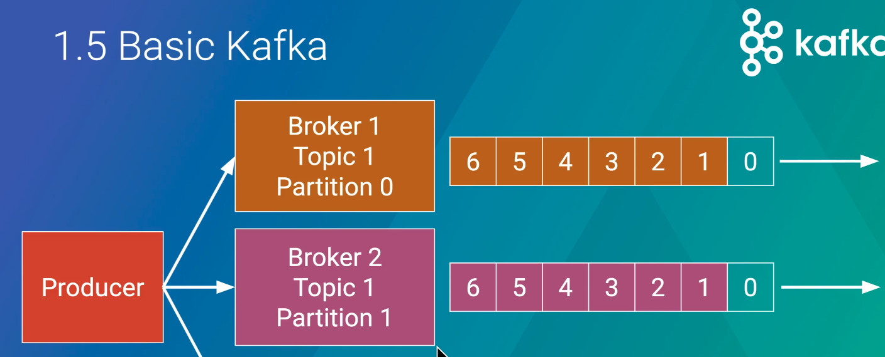
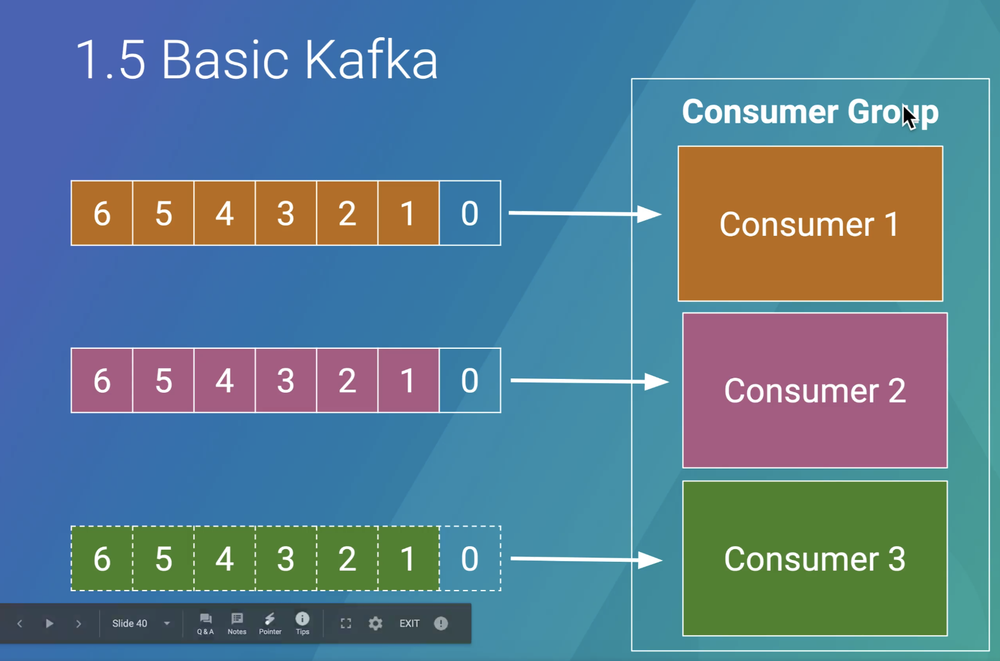
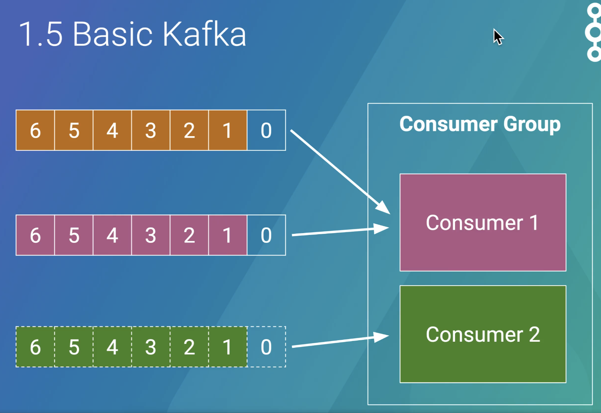
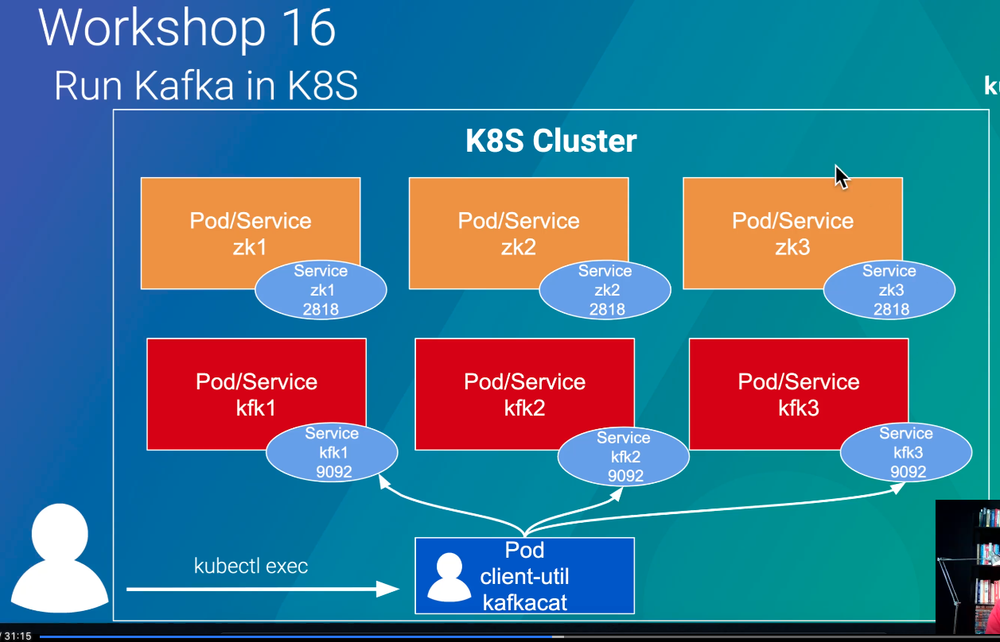

# Basic Kafka (Message queue)

- Producer : Producue message to queue
- Consumer : Get message form queue
- Broker : server แต่ละตัว
- Topic : คือหัวข้อที่ Producer ส่งเข้าไป และ Consumer จะเป็นคนดึง topic ออกมาทำงานต่อ 
> ถ้า topic นี้ consumer ไหนสนใจก็จะมาทำการ subscripe ที่ topic นั้น
- Partition : คือการแบ่ง topic เดียวกัน ออกเป็นส่วนๆ 
> ทำไมเราต้องแบ่ง topic เป็น partition ? => เพราะว่าจำนวน partition นั้นจะเป็นตัวกำหนด consumer นั้นเอง ถ้าเราต้องการให้มี Consumer หลายๆ ตัวมาช่วยกันทำงาน กับ topic นั้น เราจะต้องทำการแบ่ง partition ของ topic นั้น

## Detail

### Producer
producer จะทำการส่งข้อมูล massage (topic) โดยการ random ไปยังทุกๆ partition ยกเว้นถ้าเรามีการกำหนด messageId มันจะทำการไปที่ partition เดิมเสมอ 

โดยใน partition นั้นจะมีการเรียงลำดับของ message กันในแต่ละ partition และเมื่อมี Consumer มาเรียกใช้งานข้อมูลในแต่ละ partition ก็จะทำการอ่านข้อมูลตามลำดับ ซึ่งจะมี index ที่จะเป็นชี้ว่ามีการอ่านข้อมูลที่ลำดับที่เท่าไร หรือก็คือ ``offset`` 

### Consumer
- consumer group คือ consumer ที่อยู่ในกลุ่มเดียวกันที่จะอ่านข้อมูลของ topic เดียวกันแต่จะได้ Message ไม่ซ้ำกัน 
> แต่ละ consumer จะอ่านกันคนละ partition

ex : ถ้าเรามี 3 partition และมี Consumer group ซึ่งจะประกอบไปด้วย 3 consumer โดยแต่ละ consumer จะทำการอ่านข้อมูล กันคนละ partition 



> แต่ถ้ามี consumer ใน group ตายไป 1 ตัว (เหลือแค่ 2 consumer) ระบบจะไม่ยอมให้มี partition ที่ไม่ถูกการอ่าน message ออกไป ดังนั้น consumer ที่เหลือ 2 ตัวจะมีอยู่ 1 ตัวที่ต้องไปทำการอ่านจากข้อมูลพร้อมกันทั้ง 2 partition ทำการอ่านข้อมูล ``การ re-balanch ``



> แล้วถ้ามี 3 partition แต่ใน consumer group นั้นมี 4 consumer สิ่งที่เกิดขึ้นคือ จะมี consumer ตัวหนึ่งที่จะไม่มีการอ่านค่าจาก partition (เพราะเรามีแค่ 3 partitions) มันจะเป็นไปตาม concept ที่ว่า ``จำนวนของ partition นั้นจะเป็นสิ่งที่บอกจำนวน consumer``

## Workshop
### run kafka



1. Create namespace

```powershell
---- create namespace ----
% kubectl apply -f 00-namespace.yml 
namespace/basic-kafka created

---- check namespace ----
% kubectl get ns
NAME              STATUS   AGE
basic-kafka       Active   55s
default           Active   60d
ingress-nginx     Active   45h
kube-node-lease   Active   60d
kube-public       Active   60d
kube-system       Active   60d

```
2. Create zookeeper deployment
> zookeeper คือ software สำหรับเก็บข้อมูลที่ใช้สำหรับให้ kafka ใช้ในการอ่านระบุที่สำหรับการอ่านข้อมูลจาก partition

```powershell
--- create zk (zookeeper) 3 items ---
% kubectl apply -f 01-deployment-zk.yml
deployment.apps/zk1 created
deployment.apps/zk2 created
deployment.apps/zk3 created

--- check zookeeper ---
% kubectl get pods -n basic-kafka
NAME                   READY   STATUS    RESTARTS   AGE
zk1-76cc547698-8nhnj   1/1     Running   0          87s
zk2-7bb59d6788-tbz4d   1/1     Running   0          87s
zk3-566db54d6b-gqkzm   1/1     Running   0          87s

```

3. Create zookeeper service
```powershell
--- create service ---
kubectl apply -f 02-service-zk.yml
service/zk1 created
service/zk2 created
service/zk3 created

--- check service
% kubectl get service -n basic-kafka
NAME   TYPE        CLUSTER-IP   EXTERNAL-IP   PORT(S)                      AGE
zk1    ClusterIP   None         <none>        2181/TCP,2888/TCP,3888/TCP   38s
zk2    ClusterIP   None         <none>        2181/TCP,2888/TCP,3888/TCP   38s
zk3    ClusterIP   None         <none>        2181/TCP,2888/TCP,3888/TCP   38s
```

4. Create kafka deployment
```powershell
--- create kafka ---
kubectl apply -f 03-deployment-kfk.yml
deployment.apps/kfk1 created
deployment.apps/kfk2 created
deployment.apps/kfk3 created

--- Check ---
kubectl get po -n basic-kafka
NAME                    READY   STATUS    RESTARTS   AGE
kfk1-86886b6b84-2pj7d   1/1     Running   0          89s
kfk2-5b69dfcdb4-t9nz4   1/1     Running   0          88s
kfk3-6d4c8874c6-sksmh   1/1     Running   0          88s
zk1-76cc547698-8nhnj    1/1     Running   0          10m
zk2-7bb59d6788-tbz4d    1/1     Running   0          10m
zk3-566db54d6b-gqkzm    1/1     Running   0          10m

```

5. create kafka service

```powershell
kubectl apply -f 04-service-kfk.yml
service/kfk1 created
service/kfk2 created
service/kfk3 created

--- check service ---
kubectl get svc -n basic-kafka
NAME   TYPE        CLUSTER-IP   EXTERNAL-IP   PORT(S)                      AGE
kfk1   ClusterIP   None         <none>        9092/TCP                     26s
kfk2   ClusterIP   None         <none>        9092/TCP                     26s
kfk3   ClusterIP   None         <none>        9092/TCP                     26s
zk1    ClusterIP   None         <none>        2181/TCP,2888/TCP,3888/TCP   6m12s
zk2    ClusterIP   None         <none>        2181/TCP,2888/TCP,3888/TCP   6m12s
zk3    ClusterIP   None         <none>        2181/TCP,2888/TCP,3888/TCP   6m12s

```

6. Create client-util pod
> เราสามารถดู detail ของ pod ด้วย ``kubectl describe pod kfk1-86886b6b84-2pj7d -n basic-kafka``
```powershell
kubectl apply -f 05-client-util.yml
pod/client-util created

--- check ---
kubectl get po -n basic-kafka      
NAME                    READY   STATUS    RESTARTS   AGE
client-util             1/1     Running   0          28s
kfk1-86886b6b84-2pj7d   1/1     Running   0          7m13s
kfk2-5b69dfcdb4-t9nz4   1/1     Running   0          7m12s
kfk3-6d4c8874c6-sksmh   1/1     Running   0          7m12s
zk1-76cc547698-8nhnj    1/1     Running   0          16m
zk2-7bb59d6788-tbz4d    1/1     Running   0          16m
zk3-566db54d6b-gqkzm    1/1     Running   0          16m

--- Exec into client-util po ---
kubectl exec -it client-util -n basic-kafka -- bash
root@client-util:/# 
```

7. Run kafkacat -L to list brokers and topics

> kafkacat คือ

```powershell
--- access pod ---
kubectl exec -it client-util -n basic-kafka -- bash      
root@client-util:/# 

--- list brokers and topics
root@client-util:/# kafkacat -b "kfk1,kfk2,kfk3" -L
Metadata for all topics (from broker 3: kfk3:9092/3):
 3 brokers:
  broker 2 at kfk2:9092
  broker 3 at kfk3:9092
  broker 1 at kfk1:9092
 0 topics:

```


