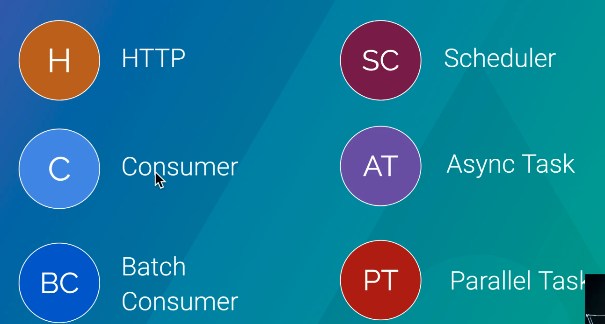
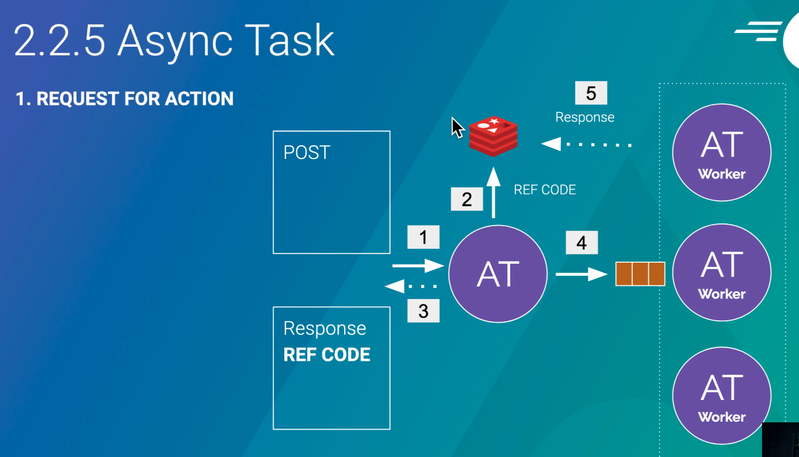
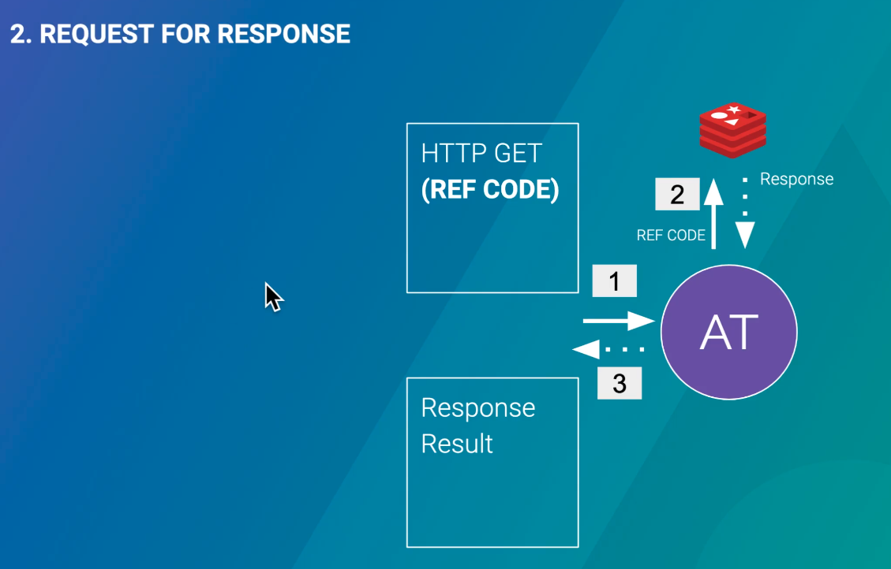
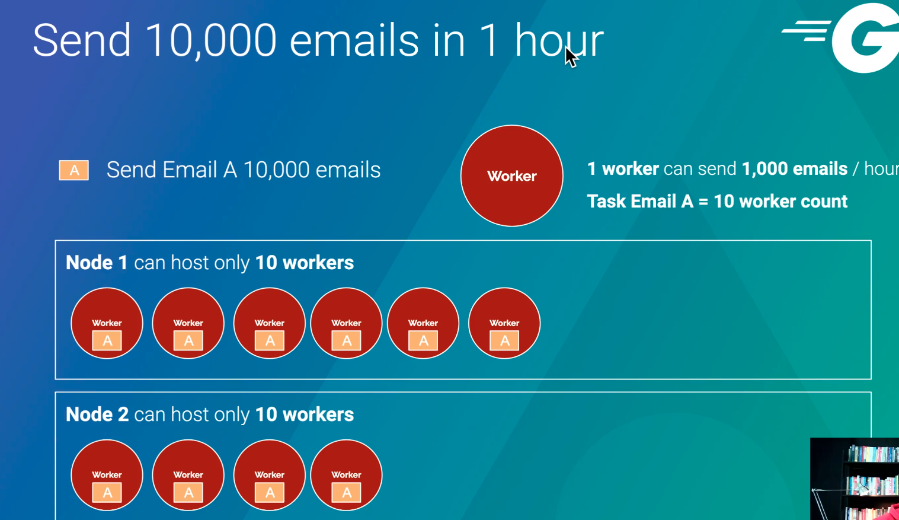
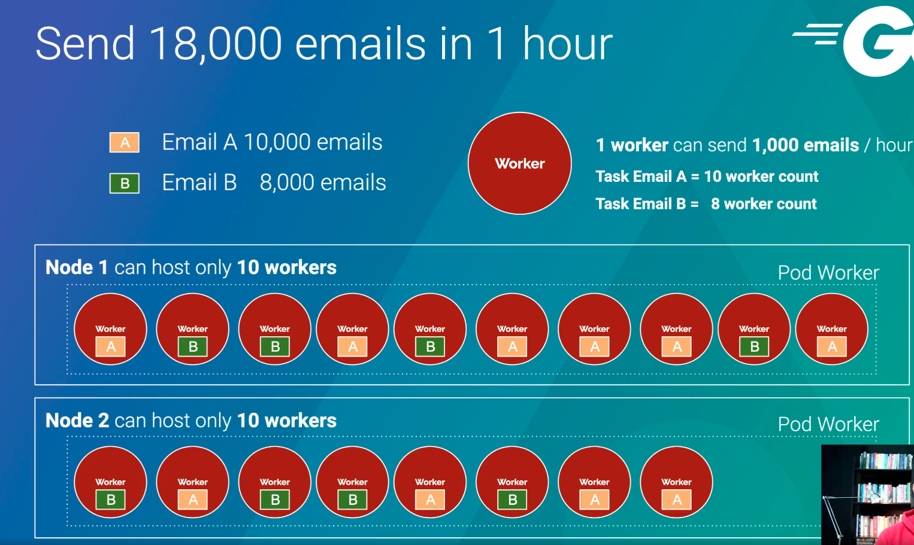
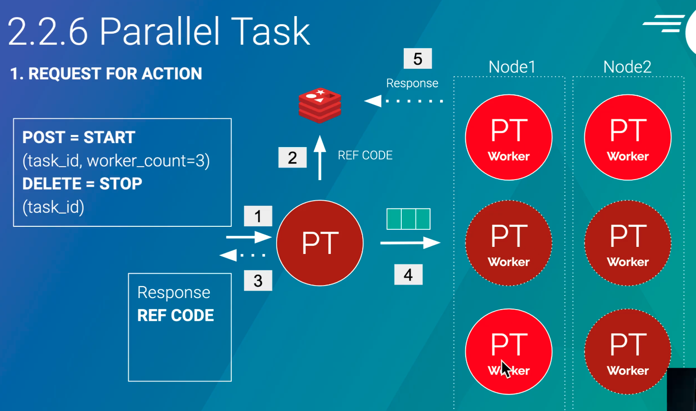
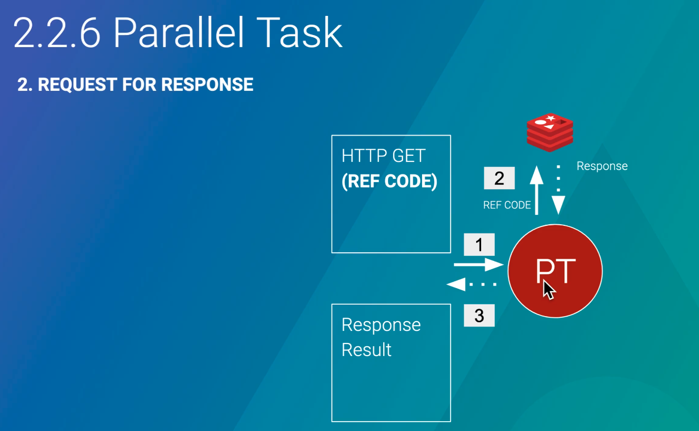
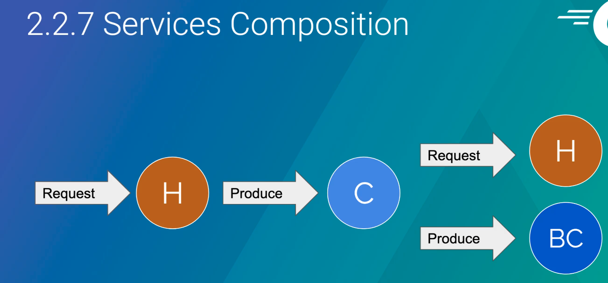

# Microservice

## Basic concept
> Service คือ Program ที่จะถูก Trigger จากภายนอกไม่ว่าจะเป็น User, other program, Other service เพื่อทำงานบ้างอย่างตามวัตถุประสงค์ของ service นั้น และทำการ response ผลลัพท์ของการทำงานออกไปได้

### Service Types


1. HTTP : จะเหมาะกับการทำงานที่ใช้ระยะเวลาสั้น โดยจะใช้ทำในส่วนของ Backend api สำหรับ Frontend (mobile,web) โดยจะเน้นทำงานในรูปแบบ Sync
```
REQUEST (GET,POST,PUT,DELETE) => PROCESS => Response body (JSON,data,....)
```

2. Consumer : จะเหมาะกับการทำงานเบื้องหลัง ที่ต้องใช้เวลาการทำงานมากและจะ Response ผลลัพธ์เมื่อทำงานเสร็จแล้ว ``จะไม่ส่งผลลัพท์หาผู้เรียกโดยตรง`` อาจจะส่งเป็น Email,Message,หรือ mark flag ใน database เป้นต้น โดย Consumer จะทำงานเป็นรูปแบบ Async โดยปกติจะทำงานกับพวก Queue หรือก็คือไปอ่านข้อมูลจาก Database หรือ Message Queue (kafka)

3. Bulk Consumer : จะทำทุกอย่างเหมือนกับ Consumer แต่จะทำที่ละหลายๆ recoard และจะต้องทำควบคู่กับ ระบบอื่นๆที่ support การทำงานแบบ Bulk เช่นถ้า Consumer Loop insert to db แต่ Bulk จะเป็นการเอา Recoard ทั้งหมดและใช้ function bulk ข้อมูลทุกๆ Recoard และทำการ save ลง database ทันที แต่ database นั้นต้อง support bulk function ด้วย

4. Scheduler : จะเป็น Service ที่จะถูก Trigger ด้วย เวลาที่กำหนดเท่านั้น และเหมาะสำหรับใช้เป็นตัวไปเรียก Service อื่นๆให้ทำงานตามเวลาที่กำหนด โดยปกติ Service scheduler จะทำงานแบบ Async และจะไม่ Response หาผู้เรียกตรงๆ โดยอาจจะใช้วิธีส่ง SMS,Email,หรือ mark flag ใน database เป็นต้น

็> HTTP Problem 

5. Async Task
    - Request for action : baseคือการที่ทาง user จะ request เพื่อสั่งงานและจะได้ ref code กลับไป โดย ref code นั้นจะมีการเก็บไว้ที่ redis data หลังจาก return refcode ไปแล้วก็จะทำการส่งการทำงานไปให้ Async Task worker เพื่อทงาน task นั้นๆ และเมื่อมีการทำงานเรียบร้อยก็จะกลับไปอัพเดตที่ redis ว่า complete หรืออาจะต้องกลับตรงในรูปแบบ Async
    
    - Request for Response : ทาง user จะคอยสอบถามสถานะของงานโดยใช้ refcode ถ้ามีการส่ง refcode ไปหาถ้างานนั้นยังไม่เสร็จระบบก็จะมีการส่งสถานะ inprogress กลับไปให้ user
    

6. parallel task : จะเหมาะกับงานที่มีการทำงานเป็นจำนวนมากและต้องให้มีการทำงานแบบ parallel เพื่อให้ทำงานเสร็จภายใต่เวลาที่จำกัด
    - porblem : ถ้าเราต้องการกระจายงานออกไปให้ worker หลายๆตัวช่วยกันทำงานให้เสร็จในเวลาที่จำกัด หรือบางกรณีงานที่ทำอาจจะไม่ได้เป็นงานเดียวกันก็ได้ โดยหลักการคราวก็คือเราจะมี pod ของ kub และเราจะกำหนดให้มีการสร้าง Workers ใน pods นั้นโดยใช้วิธีในการคำนวนว่า 1 worker ใช้เวลาทำงานเท่าไรและ ใช้ spec เท่าไรในการทำงาน ซึ่งจะทำให้เราคำนวนได้ว่า 1 pod ควรมีได้กี่ worker ``worker ก็คือ goroutine 1 ตัว ที่จะเกิดใน pod ได้``
       
    

    - request for action : เราสามารถ request เพิ่มเริ่ม task ได้ ``task_id (งานที่ต้องการทำ) , worker_count(จำนวน goroutine)`` และก็สามารถ request เพื่อ หยุดการทำงานของ task นั้นได้ ``DELETE`` และเมื่อมีการทำงานเสร็จก็จะกลับมาอัพเดตสถานะที่ redis database
    
    - request for response task
    

### Services composition



